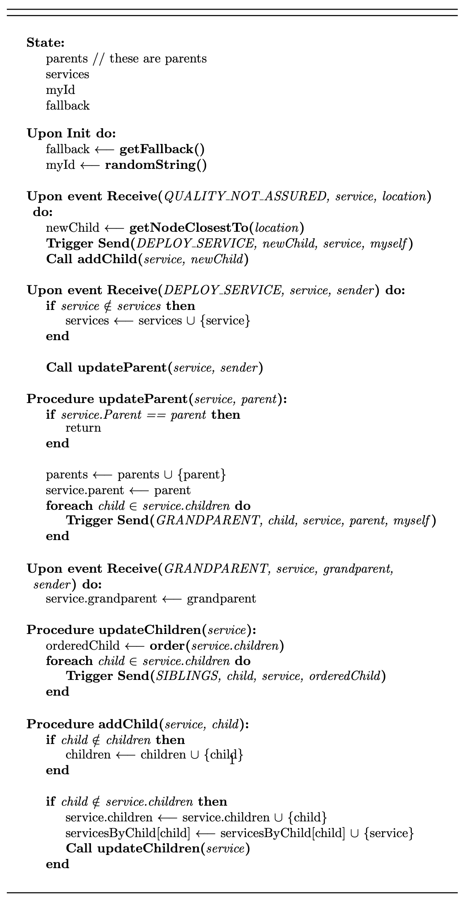

# PseudoTex
> PseudoTex is a compiler that translates pseudocode into its LaTex representation

In university I had to do a few reports in LaTex that had pseudocode. Translating the simple pseudocode to the LaTex commands was a huge struggle so I decided to make this tool that translates a simple pseudocode language into the LaTex equivalent commands. I hope it makes your life easier :grin:.

The pseudocode that PseudoTex follows is somewhat formalized in this [paper](PseudoCodeNotes.pdf) by João Leitão (check [caveats](#Caveats)).

## Installing
For now there are two ways of installing PseudoTex, either by using `cargo` or by downloading the latest binary release.

### Using cargo

```shell
λ ~/ $ cargo install pseudotex
```

### Using latest release

Go to the repository Releases page and download the binary (Linux or macOS).

### Running

```shell
λ ~/ $ pseudotex --help
PseudoTex 1.0
Bruno Anjos <bruno.vale.anjos@gmail.com>
pseudocode transpiler to latex representation

USAGE:
    pseudotex [OPTIONS]

FLAGS:
    -h, --help       Prints help information
    -V, --version    Prints version information

OPTIONS:
    -i, --input <input>      file name to read content from
    -o, --output <output>    file name to write content to
```

## Caveats

### Semi Colons

One main difference from the language described in the paper, is that every statement has to be followed by a semi colon. I believe this can be changed in the future, but since this made the parser easier to build i decided to take this approach.

## TODO

* Add more symbols
* Add tests
* Add test automation per commit
* Add subscript

## Contributing

If you'd like to contribute, please fork the repository and use a feature
branch. Pull requests are warmly welcome.

## Links

Project dependencies:
- [LALRPOP](http://lalrpop.github.io/lalrpop/)
- [clap](https://clap.rs)
- algorithm2e LaTex Package

## Example

Here is a small example (check [example_protocol.pseudo](/example_protocol.pseudo))

```pseudo
state:
    parents // these are parents ;
    services;
    myId;
    fallback;

upon init do:
    fallback = getFallback();
    myId = randomString();

upon event Receive(QUALITY_NOT_ASSURED, service, location) do:
    newChild = getNodeClosestTo(location);
    trigger Send(DEPLOY_SERVICE, newChild, service, myself);
    call addChild(service, newChild);

upon event Receive(DEPLOY_SERVICE, service, sender) do:
    if service !in services:
        services = services unite {service};
    end
    call updateParent(service, sender);

procedure updateParent(service, parent):
    if service.Parent == parent:
        return;
    end
    parents = parents unite {parent};
    service.parent = parent;
    foreach child in service.children:
        trigger Send(GRANDPARENT, child, service, parent, myself);
    end

upon event Receive(GRANDPARENT, service, grandparent, sender) do:
    service.grandparent = grandparent;

procedure updateChildren(service):
    orderedChild = order(service.children);
    foreach child in service.children:
        trigger Send(SIBLINGS, child, service, orderedChild);
    end

procedure addChild(service, child):
    if child !in children:
        children = children unite {child};
    end

    if child !in service.children:
        service.children = service.children unite {child};
        servicesByChild[child] = servicesByChild[child] unite {service};
        call updateChildren(service);
    end
```

This pseudocode generates the following LaTeX:

```Latex
\documentclass{article}
\usepackage[utf8]{inputenc}
\usepackage[ruled,vlined,linesnumbered]{algorithm2e}
\usepackage{amssymb}
\begin{document}
{{\DontPrintSemicolon
\SetAlgoNoLine
\LinesNumberedHidden
\SetFuncSty{textbf}
\begin{algorithm}[ht]
\BlankLine
\BlankLine
\BlankLine

\SetKwFunction{FunctionID}{State}
\SetKwProg{Fn}{}{:}{}
\Fn{\FunctionID}{
parents
// these are parents
\;services
\;myId
\;fallback
}

\;\SetKwFunction{FunctionID}{Init}
\SetKwProg{Fn}{Upon }{ do:}{}
\Fn{\FunctionID}{
fallback $\longleftarrow$ \FuncSty{getFallback(}\ArgSty{}\FuncSty{)}
\;myId $\longleftarrow$ \FuncSty{randomString(}\ArgSty{}\FuncSty{)}
}

\;\SetKwFunction{FunctionID}{Receive}
\SetKwProg{Fn}{Upon event }{ do:}{}
\Fn{\FunctionID{QUALITY\_NOT\_ASSURED, service, location}}{
newChild $\longleftarrow$ \FuncSty{getNodeClosestTo(}\ArgSty{location}\FuncSty{)}
\;\FuncSty{Trigger} \FuncSty{Send(}\ArgSty{DEPLOY\_SERVICE, newChild, service, myself}\FuncSty{)}
\;\FuncSty{Call addChild(}\ArgSty{service, newChild}\FuncSty{)}
}

\;\SetKwFunction{FunctionID}{Receive}
\SetKwProg{Fn}{Upon event }{ do:}{}
\Fn{\FunctionID{DEPLOY\_SERVICE, service, sender}}{
\If{service $\notin$ services}{services $\longleftarrow$ services $\cup$ \{service\}}
\;\FuncSty{Call updateParent(}\ArgSty{service, sender}\FuncSty{)}
}

\;\SetKwFunction{FunctionID}{updateParent}
\SetKwProg{Fn}{Procedure }{:}{}
\Fn{\FunctionID{service, parent}}{
\If{service.Parent == parent}{return}
\;parents $\longleftarrow$ parents $\cup$ \{parent\}
\;service.parent $\longleftarrow$ parent
\;\ForEach{child $\in$ service.children}{\FuncSty{Trigger} \FuncSty{Send(}\ArgSty{GRANDPARENT, child, service, parent, myself}\FuncSty{)}}
}

\;\SetKwFunction{FunctionID}{Receive}
\SetKwProg{Fn}{Upon event }{ do:}{}
\Fn{\FunctionID{GRANDPARENT, service, grandparent, sender}}{
service.grandparent $\longleftarrow$ grandparent
}

\;\SetKwFunction{FunctionID}{updateChildren}
\SetKwProg{Fn}{Procedure }{:}{}
\Fn{\FunctionID{service}}{
orderedChild $\longleftarrow$ \FuncSty{order(}\ArgSty{service.children}\FuncSty{)}
\;\ForEach{child $\in$ service.children}{\FuncSty{Trigger} \FuncSty{Send(}\ArgSty{SIBLINGS, child, service, orderedChild}\FuncSty{)}}
}

\;\SetKwFunction{FunctionID}{addChild}
\SetKwProg{Fn}{Procedure }{:}{}
\Fn{\FunctionID{service, child}}{
\If{child $\notin$ children}{children $\longleftarrow$ children $\cup$ \{child\}}
\;\If{child $\notin$ service.children}{service.children $\longleftarrow$ service.children $\cup$ \{child\}
\;servicesByChild[child] $\longleftarrow$ servicesByChild[child] $\cup$ \{service\}
\;\FuncSty{Call updateChildren(}\ArgSty{service}\FuncSty{)}}
}

\BlankLine
\BlankLine
\BlankLine
\end{algorithm}
\end{document}
```

Which ultimately generates the following pdf:



## Licensing

The code in this project is licensed under GPL-3.0.
